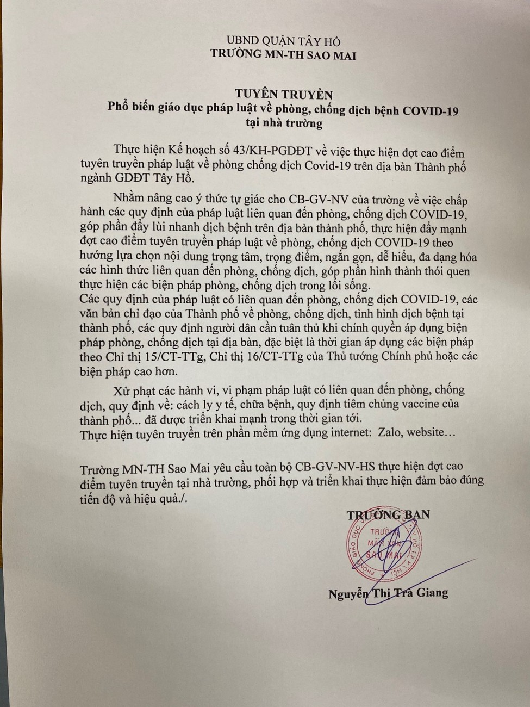
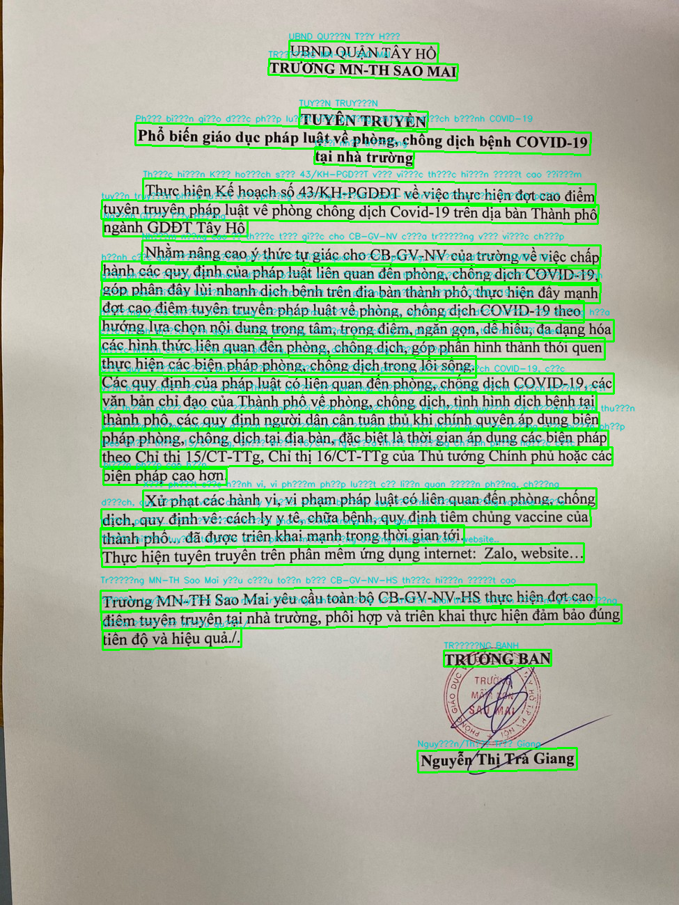

<div align="center">

# 🇻🇳 VNCV — Vietnam Computer Vision

**OCR engine tối ưu hoá cho tiếng Việt**  
Nhận dạng văn bản từ ảnh

[](https://python.org)
[](LICENSE)
[](https://github.com)
[](https://github.com/pbcquoc/vietocr)

</div>

---

## 🖼️ Demo

<table>
  <tr>
    <td align="center" width="50%">
      <b>📥 Ảnh gốc</b><br/><br/>
      
    </td>
    <td align="center" width="50%">
      <b>📤 Kết quả nhận dạng</b><br/><br/>
      
    </td>
  </tr>
</table>

---

## ✨ Tính năng

- 🔍 **OCR tiếng Việt** — Nhận dạng văn bản tiếng Việt đầy dấu với độ chính xác cao
- 🖼️ **Xử lý ảnh thông minh** — Phát hiện và cắt vùng văn bản tự động
- 📄 **Đa dạng tài liệu** — Hỗ trợ thông báo, văn bản hành chính, biển hiệu...
- ⚡ **Chạy trên CPU** — Không yêu cầu GPU, nhẹ và dễ triển khai

---

## 🚀 Cài đặt

### Yêu cầu hệ thống

- Python **3.12+**
- RAM: tối thiểu **4GB**
- Không cần GPU

### Cài đặt nhanh

```bash
# Clone repo
git clone https://github.com/Devhub-Solutions/VNCV.git
cd VNCV

# Cài đặt dependencies
pip install -r requirements.txt

# Cài đặt torchvision (CPU-only)
pip install torchvision --index-url https://download.pytorch.org/whl/cpu
```

> **Lưu ý:** Lần chạy đầu tiên sẽ tự động tải model (~18,500 items). Quá trình này chỉ xảy ra một lần.

---

## 🛠️ Sử dụng

### Chạy cơ bản

```bash
python vietocr_test.py <đường_dẫn_ảnh>
```

**Ví dụ:**

```bash
python vietocr_test.py images/output/image.png
```

### Kết quả mẫu

```python
['UBND QUẬN TÂY HỒ', 'TRƯỜNG MN-TH SAO MAI', 'TUYÊN TRUYỀN', 'Phổ biến giáo dục pháp luật về phòng, chống dịch bệnh COVID-19', 'tại nhà trường', 'Thực hiện Kế hoạch số 43/KH-PGDĐT về việc thực hiện đợt cao điểm', 'tuyên truyền pháp luật về phòng chống dịch Covid-19 trên dịa bàn Thành phố', 'Ngành GDĐT Tây Hồng', 'Nhằm nâng cao ý thức tự giác cho CB-GV-NV của trường về việc chấp', 'hành các quy định của pháp luật liên quan đến phòng, chống dịch COVID-19;', 'góp phần đẩy lùi nhanh dịch bệnh trên địa bàn thành phố, thực hiện đẩy mạnh', 'đợt cao điểm tuyên truyền pháp luật về phòng, chống dịch COVID-19 theo', 'hướng lựa chọn nội dung trọng tâm, trọng điểm, ngắn gọn, dễ hiểu, đa dạng hóa', 'các hình thức liên quan đến phòng, chống dịch, góp phần hình thành thói quen', 'thực hiện các biện pháp phòng, chống dịch trong lối sống.', 'Các quy định của pháp luật có liên quan đến phòng, chống dịch COVID-19, các', 'văn bản chỉ đạo của Thành phố về phòng, chống dịch, tình hình dịch bệnh tại', 'xã thành phố, các quy định người dân cân tuân thủ khi chính quyền áp dụng biện thuận', 'xã pháp phòng, chống dịch tại địa bàn, đặc biệt là thời gian áp dụng các biện pháp', 'theo Chỉ thị 15/CT-TTg, Chỉ thị 16/CT-TTg của Thủ tướng Chính phủ hoặc các', 'biện pháp cao hơn.', 'Xử phạt các hành vi, vi phạm pháp luật có liên quan đến phòng, chống', 'dịch, quy định về: cách ly y tế, chữa bệnh, quy định tiêm chủng vaccine của', 'thành phố... đã được triển khai mạnh trong thời gian tới.', 'Thực hiện tuyên truyền trên phân mêm ứng dụng internet: Zalo, website..', 'Trường MN-TH Sao Mai yêu cầu toàn bộ CB-GV-NV-HS thực hiện đợt cao', 'điểm tuyên truyền tại nhà trường, phối hợp và triển khai thực hiện đảm bảo đúng', 'tiến độ và hiệu quả./.', 'TRƯỞNG BANH', 'Nguyễn/Thị Trà Giang']
```

### Tích hợp vào Python

```python
from vietocr_test import extract_text

results = extract_text("path/to/your/image.png")
for line in results:
    print(line)
```

---

## 📁 Cấu trúc dự án

```
VNCV/
├── 📂 images/
│   ├── raw/          # Ảnh đầu vào gốc
│   └── output/       # Ảnh sau khi xử lý (có bounding box)
├── 📜 vietocr_test.py   # Script chính
├── 📜 requirements.txt
└── 📖 README.md
```

---

## 🐛 Gỡ lỗi thường gặp

<details>
<summary><b>Cảnh báo ONNX Runtime về PCI bus</b></summary>

```
[W:onnxruntime] Skipping pci_bus_id for PCI path...
```

Đây là cảnh báo vô hại từ thư viện ONNX trong môi trường ảo (VM/container). Không ảnh hưởng đến kết quả.

</details>

<details>
<summary><b>Lỗi <code>pkg_resources is deprecated</code></b></summary>

```
UserWarning: pkg_resources is deprecated as an API...
```

Cảnh báo từ `gdown`. Cập nhật bằng:

```bash
pip install --upgrade setuptools gdown
```

</details>

<details>
<summary><b>Chạy chậm lần đầu</b></summary>

Lần chạy đầu tiên tải ~18,500 model items qua `gdown`. Những lần sau sẽ được cache lại và khởi động nhanh hơn nhiều.

</details>

---

## 📦 Dependencies chính

| Package | Mục đích |
|---------|----------|
| `vietocr` | Engine OCR tiếng Việt |
| `torch` | Deep learning backend |
| `torchvision` | Xử lý ảnh (CPU build) |
| `onnxruntime` | Tăng tốc inference |
| `gdown` | Tải model từ Google Drive |

---

## 📜 Giấy phép & Bản quyền

**© 2026 DevHub Solutions. All rights reserved.**

Dự án được phát hành dưới **giấy phép mã nguồn mở** cho mục đích học tập và nghiên cứu.

| | Hành động |
|---|---|
| ✅ | Sử dụng, học hỏi, chỉnh sửa mã nguồn |
| ✅ | Tích hợp vào dự án cá nhân hoặc thương mại |
| ✅ | Chia sẻ lại với điều kiện ghi nguồn |
| ❌ | Đổi tên thương hiệu hoặc nhận là sản phẩm của mình |
| ❌ | Xây dựng SaaS/dịch vụ cạnh tranh mà không có phép |
| ❌ | Xóa thông báo bản quyền này |

> **DevHub Solutions** bảo lưu quyền duy trì các phiên bản private/thương mại và có thể thay đổi điều khoản cấp phép trong các phiên bản tương lai.

Để sử dụng thương mại hoặc mở rộng quyền sử dụng, vui lòng liên hệ **DevHub Solutions**.

---

<div align="center">

Made with ❤️ by **DevHub Solutions**

</div>